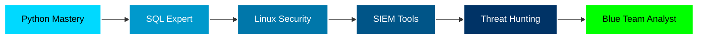

<div align="center">
  
# 👋 Hi there! I'm Emerson

### 🛡️ Data Analyst | Aspiring Blue Team Specialist | Cybersecurity Enthusiast

[](https://www.linkedin.com/in/emerson-ballesteros-diaz-599705267/)
[](mailto:emersondiaz1805+github@gmail.com)
[](https://github.com/ILOHU-cmd)

</div>
<!-- 
  ████████╗██╗  ██╗███████╗    ██████╗ ██╗     ██╗   ██╗███████╗    ████████╗███████╗ █████╗ ███╗   ███╗
  ╚══██╔══╝██║  ██║██╔════╝    ██╔══██╗██║     ██║   ██║██╔════╝    ╚══██╔══╝██╔════╝██╔══██╗████╗ ████║
     ██║   ███████║█████╗      ██████╔╝██║     ██║   ██║█████╗         ██║   █████╗  ███████║██╔████╔██║
     ██║   ██╔══██║██╔══╝      ██╔══██╗██║     ██║   ██║██╔══╝         ██║   ██╔══╝  ██╔══██║██║╚██╔╝██║
     ██║   ██║  ██║███████╗    ██████╔╝███████╗╚██████╔╝███████╗       ██║   ███████╗██║  ██║██║ ╚═╝ ██║
     ╚═╝   ╚═╝  ╚═╝╚══════╝    ╚═════╝ ╚══════╝ ╚═════╝ ╚══════╝       ╚═╝   ╚══════╝╚═╝  ╚═╝╚═╝     ╚═╝
-->

<!-- ========================================
     HEADER SECTION
     ======================================== -->
<div align="center">
  


<br/>

<!-- Typing Animation -->
<a href="https://git.io/typing-svg"></a>

<br/><br/>

<!-- Social Badges -->
[](your-linkedin-url)
[](mailto:emersondiaz1805+github@gmail.com)
[](https://twitter.com/your-handle)
[](https://your-portfolio.com)

<br/>


</div>

<br/>

<!-- ========================================
     ABOUT ME SECTION
     ======================================== -->
<details open>
<summary><h2>🎯 About Me</h2></summary>

<br/>

<table>
<tr>
<td width="50%" valign="top">

### 👨‍💻 Current Focus

```python
class BlueTeamAnalyst:
    def __init__(self):
        self.name = "Emerson"
        self.role = "Data Analyst"
        self.goal = "Blue Team Specialist"
        self.location = "Bucaramanga, Colombia 🇨🇴"
        
    def get_mission(self):
        return """
        Transforming raw data into 
        actionable security intelligence.
        Protecting systems through 
        analysis and threat detection.
        """
    
    def current_mode(self):
        return "🔍 Learning Mode: Active"
```

</td>
<td width="50%" valign="top">

### 💫 Quick Facts

```yaml
interests:
  - 🛡️ Defensive Security
  - 📊 Security Analytics
  - 🔍 Threat Intelligence
  - 🚨 Incident Response
  
mindset:
  - "Data tells stories"
  - "Defense through knowledge"
  - "Always learning"
  
philosophy:
  "The best defense is understanding
   what you're protecting and knowing
   your adversary through data"
```

</td>
</tr>
</table>

<br/>

**🔍 What I'm About:**
- 📈 Leveraging data analysis to identify security threats
- 🛡️ Building defensive capabilities through log analysis and pattern recognition
- 🎓 Continuously learning cybersecurity fundamentals and advanced techniques
- 🔐 Passionate about SOC operations and security monitoring

</details>

<br/>

<!-- ========================================
     TECH STACK SECTION
     ======================================== -->
<details open>
<summary><h2>🛠️ Tech Stack & Skills</h2></summary>

<br/>

### Languages & Tools

<div align="center">


</div>

<br/>

### 📚 Learning Progress

<table>
<tr>
<td width="50%">

**Security Focus**

```python
skills = {
    'Python for Security': '████████░░ 80%',
    'Linux Log Analysis': '█████░░░░░ 50%',
    'SIEM Tools':          '███░░░░░░░ 30%',
    'Threat Intelligence': '██░░░░░░░░ 20%',
}
```

</td>
<td width="50%">

**Data Analysis**

```python
skills = {
    'SQL Analysis':     '██████░░░░ 60%',
    'Pandas & NumPy':   '███████░░░ 70%',
    'Data Viz':         '█████░░░░░ 50%',
    'Statistical Analysis': '████░░░░░░ 40%',
}
```

</td>
</tr>
</table>

<br/>

### 🎯 Core Competencies

<table>
<tr>
<td width="33%" align="center">

**🔐 Blue Team**
  
Log Analysis • Threat Detection  
Incident Response • SOC Operations  
Security Monitoring

</td>
<td width="33%" align="center">

**📊 Data Analysis**
  
Python • Pandas • NumPy  
SQL Queries • Data Visualization  
Pattern Recognition

</td>
<td width="33%" align="center">

**🐧 Linux Security**
  
System Logs • Hardening  
Bash Scripting • Monitoring  
Forensics

</td>
</tr>
</table>

</details>

<br/>

<!-- ========================================
     GITHUB STATS SECTION
     ======================================== -->
<details open>
<summary><h2>📈 GitHub Analytics</h2></summary>

<br/>

<div align="center">

<table>
<tr>
<td width="50%">


</td>
<td width="50%">


</td>
</tr>
</table>

<br/>


<br/><br/>


</div>

</details>

<br/>

<!-- ========================================
     PROJECTS SECTION
     ======================================== -->
<details open>
<summary><h2>🔥 Featured Projects</h2></summary>

<br/>

<div align="center">

### 🛡️ Security Analytics Portfolio

</div>

<table>
<tr>
<td width="50%" valign="top">

<div align="center">
  
**📊 Security Log Analyzer**

[](https://github.com/ILOHU/log-analyzer)

</div>

Python-based automated log analysis tool for detecting suspicious patterns in Linux system logs.

**Features:**
- 🔍 Pattern matching for threat detection
- 🚨 Automated alerting system
- 📈 Data visualization dashboards
- 🔐 Security metrics tracking

**Tech:** `Python` `Pandas` `Matplotlib` `Regex`

</td>
<td width="50%" valign="top">

<div align="center">
  
**🔍 Network Traffic Monitor**

[](https://github.com/ILOHU/network-monitor)

</div>

Real-time network traffic analysis tool for identifying anomalies and potential threats.

**Features:**
- 📡 Live traffic analysis
- ⚠️ Anomaly detection algorithms
- 📊 Real-time reporting
- 💾 SQL database integration

**Tech:** `Python` `Scapy` `SQL` `Streamlit`

</td>
</tr>

<tr>
<td width="50%" valign="top">

<div align="center">
  
**📈 SOC Dashboard**

[](https://github.com/ILOHU/soc-dashboard)

</div>

Interactive security operations center dashboard for monitoring security events and metrics.

**Features:**
- 📊 Real-time security metrics
- 🎨 Interactive visualizations
- 🔔 Alert management
- 📈 Trend analysis

**Tech:** `Python` `Plotly` `Dash` `SQLite`

</td>
<td width="50%" valign="top">

<div align="center">
  
**🗄️ Threat Intelligence DB**

[](https://github.com/ILOHU/threat-intel-db)

</div>

Comprehensive threat intelligence database for cataloging IOCs and security indicators.

**Features:**
- 🎯 IOC cataloging and tagging
- 🔎 Advanced SQL queries
- 🔗 SIEM integration ready
- 📝 Automated reporting

**Tech:** `PostgreSQL` `Python` `SQLAlchemy`

</td>
</tr>
</table>

<br/>

<div align="center">

**🌟 More projects coming soon! Currently building and learning...**

</div>

</details>

<br/>

<!-- ========================================
     LEARNING ROADMAP SECTION
     ======================================== -->
<details>
<summary><h2>🎯 2026 Learning Roadmap</h2></summary>

<br/>

<div align="center">



</div>

<br/>

<table>
<tr>
<td width="33%" valign="top">

### Q1 2026 🚀
- [x] Python fundamentals
- [x] Pandas & NumPy mastery
- [ ] Advanced SQL queries
- [ ] Linux log analysis deep dive
- [ ] First security project

</td>
<td width="33%" valign="top">

### Q2 2026 📚
- [ ] Security certification prep
- [ ] SIEM tools (Splunk/ELK)
- [ ] Threat hunting basics
- [ ] CTF participation
- [ ] Networking fundamentals

</td>
<td width="33%" valign="top">

### Q3-Q4 2026 🎯
- [ ] Advanced threat detection
- [ ] Incident response practice
- [ ] Open-source contributions
- [ ] Professional certification
- [ ] First SOC role 🎉

</td>
</tr>
</table>

<br/>

<div align="center">

**📌 Current Focus:** Building practical security projects while deepening Linux and SQL knowledge

</div>

</details>

<br/>

<!-- ========================================
     BLOG & ACTIVITY SECTION
     ======================================== -->
<details>
<summary><h2>📝 Latest Activity & Insights</h2></summary>

<br/>

### 🔖 Recent Learning Notes

- 🔍 **Log Analysis Techniques:** Explored different approaches to parse and analyze auth.log files for suspicious activities
- 🐍 **Python Security Libraries:** Discovered powerful modules like `scapy`, `dpkt`, and `pyshark` for network analysis
- 🗄️ **SQL for Security:** Learning advanced JOIN operations for correlating security events across multiple tables
- 🛡️ **SIEM Basics:** Started hands-on practice with ELK stack for centralized logging

### 💡 Security Principles I Live By

> **"The best defense is knowing what you're defending"**  
> Understanding your infrastructure is the first step to protecting it.

> **"Data doesn't lie, you just need to know how to listen to it"**  
> Logs and metrics tell the complete story - if you know where to look.

> **"Every incident is a learning opportunity"**  
> Post-mortems and analysis make you stronger for the next challenge.

### 📖 Currently Reading

- 📘 "The Art of Network Security Monitoring" - Richard Bejtlich
- 📙 "Practical Malware Analysis" - Michael Sikorski
- 📕 "Blue Team Handbook" - Don Murdoch

</details>

<br/>

<!-- ========================================
     CONNECT SECTION
     ======================================== -->
<details open>
<summary><h2>📫 Let's Connect</h2></summary>

<br/>

<div align="center">

<table>
<tr>
<td align="center" width="25%">

### 📧 Email
[emersondiaz1805+github@gmail.com](mailto:emersondiaz1805+github@gmail.com)

</td>
<td align="center" width="25%">

### 💼 LinkedIn
[Connect with me](https://linkedin.com/in/your-profile)

</td>
<td align="center" width="25%">

### 🐦 Twitter
[@your-handle](https://twitter.com/your-handle)

</td>
<td align="center" width="25%">

### 🌐 Portfolio
[your-site.com](https://your-site.com)

</td>
</tr>
</table>

<br/>

### 💬 Open to Opportunities

I'm actively seeking opportunities in:
- 🔐 **Security Operations Center (SOC)** roles
- 📊 **Security Data Analyst** positions
- 🎓 **Cybersecurity internships** and mentorships
- 🤝 **Collaborative security projects**

<br/>

**📩 Feel free to reach out for:**
- Security discussions and knowledge sharing
- Collaboration on open-source security tools
- Learning together and sharing resources
- Networking in the cybersecurity community

</div>

</details>

<br/><br/>

<!-- ========================================
     FOOTER SECTION
     ======================================== -->
<div align="center">

### 🌟 *"Transforming data into security, one log at a time"* 🌟

<br/>

**⭐ Enjoying my projects? Consider starring them!**

<br/>

[](https://github.com/ILOHU)
[](https://github.com/ILOHU)

<br/><br/>


</div>

<!-- 
  ╔═══════════════════════════════════════════════════════════════════════════╗
  ║  Thanks for visiting my profile!                                          ║
  ║  Feel free to explore my repositories and reach out for collaboration.    ║
  ╚═══════════════════════════════════════════════════════════════════════════╝
-->
