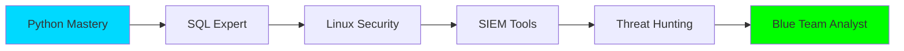

<div align="center">
  
# 👋 ¡Hola! Soy [Tu Nombre]

### 🛡️ Analista de Datos | Aspirante a Blue Team | Cybersecurity Enthusiast

[]((https://www.linkedin.com/in/emerson-ballesteros-diaz-599705267/))
[](mailto:tu-email)
[](https://github.com/tu-usuario)

</div>

---

## 🎯 Sobre Mí

```python
class BlueTeamAnalyst:
    def __init__(self):
        self.nombre = "Tu Nombre"
        self.rol = "Analista de Datos"
        self.objetivo = "Blue Team Specialist"
        self.ubicacion = "Bucaramanga, Colombia"
        
    def habilidades_actuales(self):
        return {
            "analisis": ["Python", "Pandas", "Data Analysis"],
            "aprendiendo": ["SQL", "Linux Logs", "SIEM"],
            "intereses": ["Threat Detection", "Security Analytics", "SOC"]
        }
    
    def mision(self):
        return "Proteger sistemas mediante análisis de datos y detección de amenazas"
```

🔍 Apasionado por transformar datos en insights de seguridad  
🛡️ En camino a convertirme en un especialista de Blue Team  
📊 Combinando análisis de datos con ciberseguridad defensiva  

---

## 🛠️ Stack Tecnológico

### Lenguajes & Herramientas

<div align="center">


</div>

### 📚 Actualmente Aprendiendo

```bash
[████████░░] 80% Python for Security
[██████░░░░] 60% SQL Analysis
[█████░░░░░] 50% Linux Log Analysis
[███░░░░░░░] 30% SIEM Tools
[██░░░░░░░░] 20% Threat Intelligence
```

### 🎓 Áreas de Enfoque

- **🔐 Blue Team**: Análisis de logs, detección de amenazas, respuesta a incidentes
- **📊 Data Analysis**: Pandas, NumPy, visualización de datos
- **🐧 Linux Security**: Análisis de logs del sistema, hardening, monitoreo
- **🗄️ Databases**: SQL para consultas de seguridad y análisis forense
- **🚨 SIEM**: Aprendiendo a correlacionar eventos de seguridad

---

## 📈 Estadísticas de GitHub

<div align="center">
  


</div>

---

## 🔥 Proyectos Destacados

### 🛡️ Security Analytics

<table>
<tr>
<td width="50%">

#### 📊 Log Analyzer
Script Python para análisis automatizado de logs de Linux
- Detección de patrones sospechosos
- Alertas automáticas
- Visualización de datos
  
`Python` `Pandas` `Security`

</td>
<td width="50%">

#### 🔍 Network Monitor
Herramienta de monitoreo de red
- Análisis de tráfico
- Detección de anomalías
- Reportes en tiempo real
  
`Python` `Scapy` `SQL`

</td>
</tr>

<tr>
<td width="50%">

#### 📈 Security Dashboard
Dashboard interactivo para SOC
- Métricas de seguridad
- Visualización de eventos
- Indicadores de compromiso
  
`Python` `Plotly` `Streamlit`

</td>
<td width="50%">

#### 🗄️ Threat Database
Base de datos de amenazas
- Catalogación de IOCs
- Queries SQL optimizadas
- Integración con SIEM
  
`SQL` `PostgreSQL` `Python`

</td>
</tr>
</table>

---

## 🎯 Roadmap de Aprendizaje 2026



### Q1 2026
- ✅ Dominar Python para análisis de seguridad
- 🔄 SQL avanzado para bases de datos de seguridad
- 🔄 Análisis profundo de logs de Linux

### Q2 2026
- 📋 Certificación en ciberseguridad
- 📋 Práctica con herramientas SIEM (Splunk/ELK)
- 📋 Threat Hunting básico

### Q3-Q4 2026
- 📋 CTFs y práctica en Blue Team
- 📋 Contribuir a proyectos open source de seguridad
- 📋 Primer rol en SOC

---

## 💡 Citas que me inspiran

> *"La mejor defensa es saber lo que estás defendiendo"* 

> *"Los datos no mienten, solo necesitas saber cómo escucharlos"*

---

## 📫 Conecta Conmigo

<div align="center">

📧 **Email:** tu-email@example.com  
💼 **LinkedIn:** [Tu Perfil](https://linkedin.com/in/tu-perfil)  
🐦 **Twitter:** [@tu-usuario](https://twitter.com/tu-usuario)  
📝 **Blog:** [tu-blog.com](https://tu-blog.com)

</div>

---

<div align="center">

### 🌟 "Transformando datos en seguridad, un log a la vez" 🌟


**⭐ ¿Te gustó mi perfil? ¡Dale una estrella a mis repos!**

</div>

---

<div align="center">
  
</div>
